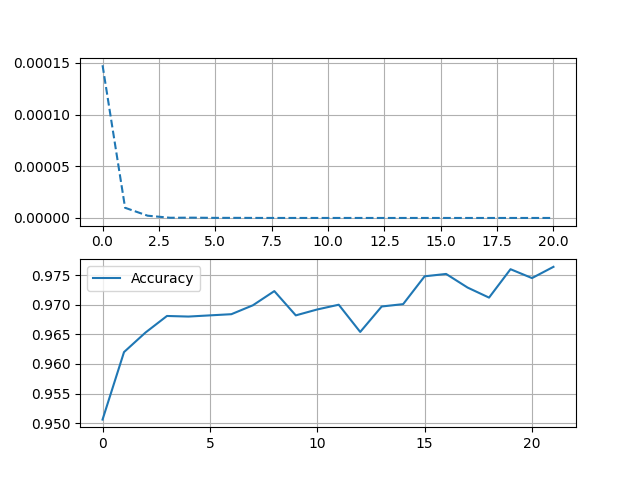

# BPNetwork

人工神经网络是实现人工智能的关键技术。反向传播是一种通过最小化预测误差来优化神经网络参数的算法，其核心思想是利用梯度下降法调整网络权重，以提高预测准确性。本文讨论了反向传播人工神经网络的原理，阐述了该模型的前向传播与反向传播以及参数更新的过程，并用MNIST数字手写体数据集进行模型验证。该模型识别准确率在测试集中达到97.64\%。

[![Contributors][contributors-shield]][contributors-url]
[![Forks][forks-shield]][forks-url]
[![Stargazers][stars-shield]][stars-url]
[![Issues][issues-shield]][issues-url]
[![MIT License][license-shield]][license-url]
[![LinkedIn][linkedin-shield]][linkedin-url]

## 目录

- [模型结构参数](#模型结构参数)
- [训练结果](#训练结果)
- [配置要求](#配置要求)
- [版本控制](#版本控制)
- [贡献者](#贡献者)
- [版权说明](#版权说明)

## 模型结构参数

输入层神经元维度为784；隐含层维度128；输出层维度为10；学习率为0.01。

## 训练结果

如下图所示，模型交叉熵损失在10的-10次方的数量级，识别准确率达到97.64\%。原理推导详见[此处](./doc/基于BP人工神经网络的数字手写体识别模型.pdf)。数据集见[此处](./dataset/mnist_train.csv)与[此处](./dataset/mnist_test.csv)。

## 配置要求

1. numpy~=1.24.4
2. pandas~=2.0.3
3. matplotlib~=3.7.5

## 版本控制

该项目使用Git进行版本管理。您可以在repository参看当前可用版本。

## 贡献者

**Lorenzo Feng**  
:mailbox: lorenzo.feng@njust.edu.cn

:airplane: Telegram: [Click Me](https://t.me/lorenzofeng)    

 *您也可以在贡献者名单中参看所有参与该项目的开发者。*

## 版权说明

该项目签署了MIT 授权许可，详情请参阅 [LICENSE](https://github.com/7emotions/ChromiumSpider/blob/master/LICENSE.txt)

<!-- links -->

[your-project-path]:njust-opensource/BPNetwork
[contributors-shield]: https://img.shields.io/github/contributors/njust-opensource/BPNetwork.svg?style=flat-square
[contributors-url]: https://github.com/njust-opensource/BPNetwork/graphs/contributors
[forks-shield]: https://img.shields.io/github/forks/njust-opensource/BPNetwork.svg?style=flat-square
[forks-url]: https://github.com/njust-opensource/BPNetwork/network/members
[stars-shield]: https://img.shields.io/github/stars/njust-opensource/BPNetwork.svg?style=flat-square
[stars-url]: https://github.com/njust-opensource/BPNetwork/stargazers
[issues-shield]: https://img.shields.io/github/issues/njust-opensource/BPNetwork.svg?style=flat-square
[issues-url]: https://img.shields.io/github/issues/njust-opensource/BPNetwork.svg
[license-shield]: https://img.shields.io/github/license/njust-opensource/BPNetwork.svg?style=flat-square
[license-url]: https://github.com/njust-opensource/BPNetwork/blob/master/LICENSE
[linkedin-shield]: https://img.shields.io/badge/-LinkedIn-black.svg?style=flat-square&logo=linkedin&colorB=555
[linkedin-url]: https://linkedin.com/in/shaojintian
